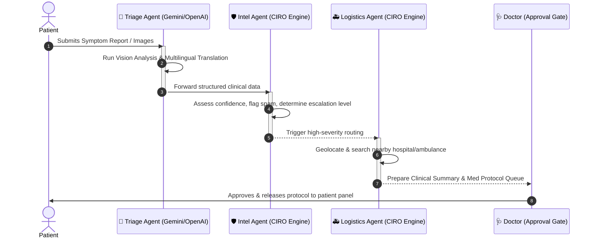

# 🏥 MediLink: Autonomous Multi-Agent Emergency Triage & Crisis Orchestration (CIRO)

🚀 **Production Deployment Live Link:** [https://medilink-ai-web-761278272100.us-central1.run.app](https://medilink-ai-web-761278272100.us-central1.run.app)

MediLink is a production-grade, serverless multi-agent crisis response platform designed to automate and optimize the emergency triage cycle. Leveraging a **real-time Reactive Data Architecture**, **Secure Next.js Server-Side Proxies**, and a **Multi-Agent Orchestration Engine (CIRO)**, MediLink bridges the gap between critical patient incidents, dispatcher logistics, and clinical approvals.

---

## 🗺️ System Topology & Portal Index
The platform is organized into four purpose-built clinical and operational portals:
*   **Intake & Patient Guidance Panel (`/patient`):** Dynamic, empathetic symptom ingestion supporting localized languages (Urdu, Roman Urdu, English), image upload, and color-coded first-aid action boards.
*   **Emergency Dispatch Hub (`/emergency`):** A high-fidelity dispatcher screen featuring dark-themed interactive geographic tracking, autonomous resources panel, and live chat sync.
*   **Doctor Panel (`/doctor`):** Highly secure clinical interface providing patient condition summaries, clear medication review queues, and medical protocol approvals.
*   **CIRO Control Center (`/ciro`):** High-level view showing real-time logs of agent thought processes, escalations, system-wide signals fusion, and autonomous cluster warnings.

---

## 🤖 The CIRO Multi-Agent Engine
MediLink's backend features a robust Multi-Agent Orchestration loop (Crisis Intelligence & Response Orchestration - CIRO). Rather than relying on simple linear API calls, autonomous specialized agents work together asynchronously to analyze, evaluate, and resolve cases:



### 1. 🧠 The Clinical Triage Agent
*   **Primary Engine:** Gemini 2.0 Flash (with high-availability GPT-4o-mini fallback).
*   **Multilingual Support:** Auto-detects and processes standard English, Script Urdu (میرے سر میں درد ہے), Roman Urdu (sar me dard hai), and regional variations.
*   **Vision-Enabled:** Evaluates attached trauma/symptom photos and merges the findings into the core triage payload.
*   **Separation of Concerns:** Outputs distinct consumer-facing instructions (first aid, safety alerts) and clinician-facing suggestions (doctor review medicines) to avoid self-medication hazards.

### 2. 🛡️ The Intel Agent (Crisis Fusion)
*   **Role:** Analyzes raw incoming reports for authenticity, clinical credibility, and systemic threat.
*   **Autonomous Escalation:** Computes a confidence score based on the patient's description, location accuracy, and historical trend data. High-severity/low-confidence edge cases are auto-flagged for manual dispatcher dispatch.
*   **Spam Filtering:** Filters mock data, jokes, or non-medical entries, marking them as `SYSTEM_NOTICE` or `isSpam` to keep priority dispatch queues clear.

### 3. 🚑 The Logistics Agent (Resource Router)
*   **Role:** Solves critical patient routing issues the instant a high-severity (Critical/High) incident is confirmed.
*   **Live Scanning:** Queries regional Google Places API databases for nearest medical units using the secure `/api/places` server-side proxy.
*   **Autonomous Calculations:** Computes distance, computes travel time (ETA) for both the ambulance-to-patient and patient-to-hospital legs, and prepares the optimum routing proposal for dispatchers.

---

## 🛠️ Technology Stack & Architecture

### Core Frontend & Styles
*   **Framework:** Next.js 14 (App Router) built in **Standalone Mode** for ultra-low container memory footprints.
*   **Styling:** Custom-tailored **Vanilla CSS & HSL CSS variables** (curated slate/emerald/amber/red palettes) for a high-fidelity, high-contrast Dark Mode.
*   **Animations:** Micro-interactions and fluid panel state transitions driven by **Framer Motion**.

### Database & Network
*   **Real-time DB:** Cloud Firestore. All portals use persistent real-time subscription streams (`onSnapshot`) to coordinate state updates across tabs instantaneously.
*   **Geospatial Tracking:** Dark-themed maps utilizing clean **Leaflet.js + OpenStreetMap (CartoDB Dark Matter)** overlays which eliminate heavy maps loading delays and domain restriction issues.
*   **Server-Side Security Proxies:** Custom secure routing `/api/places` and `/api/ai/triage` hide critical keys (Gemini, OpenAI, Google Maps) entirely from client browsers, preventing credential theft.

---

## 🔒 Cloud Native Security & Standalone Build Pipeline
The production environment runs as a highly scalable **Google Cloud Run** container. The build process utilizes a custom docker-ignore file to handle local credentials correctly:

1.  **`.gcloudignore` Deployment Layer:** Custom rules prevent local Git configs and local environment directories (`.env.local`) from bloating build times, while explicitly allowing `.env.production` to upload.
2.  **Environment Variable Baking:** Public environment variables (`NEXT_PUBLIC_`) are resolved correctly at Next.js compile-time on Cloud Build servers without hardcoded credential risk.
3.  **Standalone Output Tracing:** Next.js standalone server configuration copies only the exact file paths and module bundles required to run the production app, reducing the Docker container footprint to under 150MB.

---

## 🚦 Getting Started Locally

### Prerequisites
*   Node.js (v18.0.0 or higher)
*   Google Cloud SDK / Firebase project initialized

### 1. Installation & Dependencies
Clone and install packages:
```bash
git clone <your-repo-url>
cd medilink
npm install --legacy-peer-deps
```

### 2. Configure Environment Keys
Create a `.env.production` file at the root level:
```env
# Firebase Configuration
NEXT_PUBLIC_FIREBASE_API_KEY=your_firebase_api_key
NEXT_PUBLIC_FIREBASE_AUTH_DOMAIN=your_project.firebaseapp.com
NEXT_PUBLIC_FIREBASE_PROJECT_ID=your_project_id
NEXT_PUBLIC_FIREBASE_STORAGE_BUCKET=your_project.firebasestorage.app
NEXT_PUBLIC_FIREBASE_MESSAGING_SENDER_ID=your_sender_id
NEXT_PUBLIC_FIREBASE_APP_ID=your_app_id

# AI API Keys
GEMINI_API_KEY=your_gemini_key
OPENAI_API_KEY=your_openai_key

# Google Maps API Key
NEXT_PUBLIC_GOOGLE_MAPS_API_KEY=your_google_maps_key
```

### 3. Start Development Server
```bash
npm run dev
```
Open [http://localhost:3000](http://localhost:3000) to view the platform locally.

---

## 🤝 Clinical Safety Notice
*MediLink is a prototype designed for hackathon demonstration. Clinical protocols, pharmaceutical suggestions, and triage levels are simulated using Generative AI. Patients should consult certified clinical providers or contact regional emergency lines in a real crisis.*

---
**Developed by the MediLink Team for the Advanced Agentic Hackathon.**
