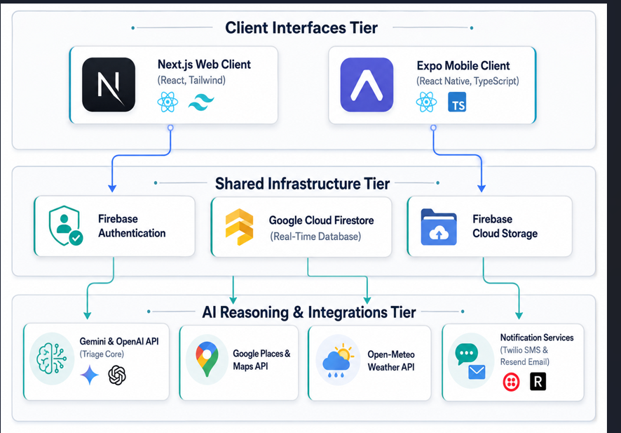

# 🏥 MediLink — Autonomous Multi-Agent Emergency Triage & Crisis Orchestration (CIRO)

> **🚀 Live Production URL:** [https://medilink-ai-web-761278272100.us-central1.run.app](https://medilink-ai-web-761278272100.us-central1.run.app)
>
> **🎥 Architecture & Walkthrough Video:** Watch the whole architecture and full detailed video [here](https://drive.google.com/file/d/1KVtLTvBYKzPg7AY4p4Cfyko4dUfaT2JD/view?usp=sharing)
---

## 📖 What Is MediLink?

MediLink is a **production-grade, serverless autonomous emergency response platform** built for the Google Hackathon. It is not a simple chatbot — it is a **multi-agent orchestration system** (CIRO: Crisis Intelligence & Response Orchestration) that manages the full lifecycle of an emergency from the moment a patient reports symptoms to the final doctor approval and ambulance dispatch.

The platform solves a critical gap in emergency response: **the seconds between when someone calls for help and when professional help actually arrives**. MediLink fills that gap with real-time AI triage, multilingual communication, autonomous resource routing, and live coordination between patients, dispatchers, and doctors — all running as a cloud-native containerized Next.js application.

---

## 🗺️ Portal Index — Four Operational Interfaces

| Portal | Route | Purpose |
|--------|-------|---------|
| **Patient Intake Portal** | `/patient` | Symptom reporting, voice, image upload, AI guidance, live chat |
| **Emergency Dispatch Hub** | `/emergency` | Dispatcher dashboard, live case queue, map tracking, Intel feed |
| **Doctor Panel** | `/doctor` | Clinical review, medication approval, patient safety protocols |
| **CIRO Control Center** | `/ciro` | City-wide agent reasoning feed, crisis detection, resource logs |

---

## 🤖 The CIRO Multi-Agent Engine — Full Architecture



MediLink's intelligence is powered by **five specialized autonomous agents** that work together in a pipeline. Each agent writes its reasoning steps as live logs visible in the CIRO Control Center.

### Agent Pipeline Overview

```
Patient Submits Case
       │
       ▼
┌─────────────────────┐
│  1. Triage Agent    │  ← /api/ai/triage (Gemini 2.5 Flash)
│  (Clinical AI)      │    Multilingual analysis, image vision,
│                     │    triage severity, first aid, medicines
└────────┬────────────┘
         │ structured AIAnalysis payload → saved to Firestore
         ▼
┌─────────────────────┐
│  2. Intel Agent     │  ← services/intelAgent.ts
│  (Crisis Fusion)    │    Multi-source signal fusion:
│                     │    Cluster scan + Weather + Map + Social
└────────┬────────────┘
         │ confidence score calculated
         ▼
┌─────────────────────┐
│  3. Orchestrator    │  ← embedded in ciroService.ts
│  (Decision Hub)     │    Routes to crisis path OR standard dispatch
│                     │    Logs every decision to intelligence_logs
└────────┬────────────┘
         │
    ┌────┴────┐
    ▼         ▼
┌────────┐  ┌───────────────────┐
│Crisis  │  │  4. Logistics     │  ← services/logisticsAgent.ts
│Event   │  │  Agent            │    Finds nearest hospitals/
│Written │  │                   │    ambulances, calculates ETAs,
│to DB   │  │                   │    sends chat updates to patient
└────────┘  └────────┬──────────┘
                     │
                     ▼
            ┌─────────────────┐
            │  5. Strategist  │  ← ciroService.scheduleMedicineReminders()
            │  Agent          │    Parses prescription time strings,
            │  (Continuity)   │    queues medication reminders,
            │                 │    sends email/SMS notifications
            └─────────────────┘
```

---

### Agent 1: 🧠 Clinical Triage Agent (`/api/ai/triage`)

**File:** `app/api/ai/triage/route.ts` (1,062 lines)

This is the primary AI brain. It runs on every emergency case submission.

#### How It Works
1. Patient submits symptoms text + optional image via `PatientForm.tsx`
2. `aiService.ts` sends a POST request to `/api/ai/triage`
3. The route executes a **4-tier failover chain**:

| Priority | Provider | Model | Condition |
|----------|----------|-------|-----------|
| 1st | Gemini Primary Key | `gemini-2.5-flash` | Primary key has quota |
| 2nd | Gemini Fallback Key | `gemini-2.5-flash` | Primary key exhausted |
| 3rd | Gemini Fallback Key | `gemini-2.0-flash` | 2.5 model unavailable |
| 4th | OpenAI | `gpt-4o-mini` | All Gemini attempts failed |
| 5th | Local Template | keyword matcher | All APIs failed |

#### What the Triage Prompt Produces
The `TRIAGE_PROMPT` (~170 lines) instructs the AI to return a structured JSON object:

```json
{
  "detectedLanguage": "roman-urdu",
  "normalizedInputEnglish": "I have a severe headache and dizziness",
  "possibleConditions": ["Migraine", "Hypertensive crisis", "Dehydration"],
  "triageLevel": "high",
  "confidence": 0.88,
  "patientMessage": "Empathetic patient-facing advice...",
  "doctorSummary": "Clinical summary for physician review...",
  "recommendedFirstAid": ["Lie down in a dark room", "Drink water slowly"],
  "doctorReviewMedicines": ["Paracetamol 500mg (doctor review only)"],
  "redFlags": ["Sudden worst headache of life", "Vision changes"],
  "safetyWarnings": ["Do not drive", "Do not take aspirin without doctor confirmation"],
  "requiresImmediate": true,
  "summary": "High severity case, possible hypertensive episode"
}
```

#### Multilingual Normalizer
The route contains a 200-line `normalizeLocalMedicalText()` function that pre-processes:
- **Roman Urdu** → `"sar dard"` → `"headache"`
- **Urdu Script** → `"درد"` → `"pain"`
- **Mixed language** → normalized English hints

This normalized text is passed alongside the raw input to the AI, helping it understand even heavily colloquial patient language.

#### Vision Analysis
If the patient uploads an image (base64), it is attached as an `inlineData` part to the Gemini multimodal request, allowing the AI to visually assess wounds, rashes, swelling, burns, etc.

---

### Agent 2: 🛡️ Intel Agent (`services/intelAgent.ts`)

**File:** `services/intelAgent.ts` (425 lines)

The Intel Agent performs **multi-source signal fusion** to determine if an individual emergency is part of a larger crisis event.

#### 8-Step Pipeline

**Step 1 — Signal Received**
Logs GPS coordinates and severity. Initiates the fusion pipeline.

**Step 2 — Cluster Scan (Firestore)**
Queries the `cases` collection for all reports within a **1.5km radius** in the **last 30 minutes** using Haversine distance calculation.
- 2+ nearby cases → `CLUSTER_DETECTED` → confidence `+20-60%`
- 1 nearby case → monitoring → confidence `+15%`
- 0 nearby cases → isolated incident

**Step 3 — Weather Check (Open-Meteo API)**
Calls the free Open-Meteo API (no API key required) for real-time weather at the incident coordinates:
- Interprets WMO weather codes (thunderstorm, heavy rain, fog, etc.)
- Bad weather → confidence `+15%`
- Returns: wind speed, precipitation, weather label

**Step 4 — Map Context (Google Places API)**
Checks for high-risk infrastructure within 400m:
- Hospital, school, transit station
- If Google Maps key unavailable → keyword-based demo inference
- High-risk zone detected → confidence `+10%`

**Step 5 — Social Signal Corroboration (Firestore)**
Reads the `social_signals_demo` Firestore collection for active signals within **3km**:
- Real signals from DB → confidence boost `+8% per signal` (max +15%)
- Empty DB with high severity → generates demo signals for hackathon

**Step 6 — Severity Bonus**
`critical` or `high` severity cases → confidence `+10%`

**Step 7 — Composite Score**
Combines all signals → final `confidenceScore` (0.0–1.0)

**Step 8 — Crisis Decision (65% threshold)**
- **≥ 65%** → writes `crisis_events` Firestore document → classifies as:
  - `"Urban Flood Emergency"` (weather + cluster)
  - `"Multi-Casualty Incident"` (cluster without weather)
  - `"High-Risk Emergency Zone"` (other high confidence)
- **< 65%** → routes as isolated case to Emergency Dispatch Hub

Every step writes a detailed reasoning log to `intelligence_logs` Firestore collection, visible in real-time on the CIRO Control Center.

---

### Agent 3: 🚦 Orchestrator (embedded in `ciroService.ts`)

**File:** `services/ciroService.ts` (224 lines)

The Orchestrator is the coordination hub. It:
- Receives escalation decisions from the Intel Agent
- Routes crisis events to the Logistics Agent
- Logs every routing decision to `intelligence_logs`
- Manages the **Continuity Agent** (medication scheduling)
- Deduplicates logs using Firestore `action` field checking

#### Deduplication System
Every `addIntelligenceLog()` call first queries Firestore to check if a log with the same `caseId + action` already exists. This prevents duplicate agent runs when multiple dispatchers view the same case simultaneously.

---

### Agent 4: 🚑 Logistics Agent (`services/logisticsAgent.ts`)

**File:** `services/logisticsAgent.ts` (306 lines)

Triggered for all `critical` or `high` severity cases. Finds nearest emergency resources and calculates routing.

#### Resource Discovery
1. Calls Google Places Nearby Search API (via `/api/places` server-side proxy) for `hospital` and `ambulance` types within 5km
2. Fetches phone numbers via Places Details API
3. Calculates Haversine distances and estimated travel times
4. If Places API unavailable → falls back to Pakistan-specific mock facilities (Hayatabad Medical Complex, Lady Reading Hospital, Edhi Foundation Ambulance, Rescue 1122)

#### Output
```typescript
interface LogisticsResult {
  hospitals: NearbyFacility[];        // Up to 3 nearest hospitals
  ambulanceServices: NearbyFacility[]; // Up to 2 nearest ambulances
  bestHospital: NearbyFacility | null;
  patientToHospitalEta: string;       // e.g. "9 mins"
  ambulanceToPatientEta: string;      // e.g. "3 mins"
  success: boolean;
}
```

The Logistics Agent also sends a formatted **chat message directly to the patient** via `chatService.sendMessage()`, including hospital name, address, phone number, and ambulance ETA.

---

### Agent 5: 📅 Strategist Agent — Continuity (in `ciroService.ts`)

The Strategist Agent handles **post-discharge medication continuity**.

When a doctor approves a medication protocol, `scheduleMedicineReminders()`:
1. Parses time strings from frequency fields (e.g. `"Take at 11:00 PM"`) using regex
2. Calculates the next scheduled time (adjusts for same-day vs next-day)
3. Writes a `scheduled_tasks` Firestore document with `status: "pending"`
4. Triggers email/SMS notifications via `notificationService.ts`

---

## 📁 Folder Structure

```
medilink/
├── app/
│   ├── page.tsx                    # Landing page / portal selector
│   ├── layout.tsx                  # Root layout with ThemeProvider
│   ├── globals.css                 # Global CSS, HSL design tokens
│   ├── fonts/                      # Local font assets
│   ├── (dashboard)/                # Route group (shared layout)
│   │   ├── layout.tsx              # Dashboard shell layout
│   │   ├── patient/
│   │   │   └── page.tsx            # Patient portal (376 lines)
│   │   ├── emergency/
│   │   │   └── page.tsx            # Emergency dispatch hub
│   │   ├── doctor/
│   │   │   └── page.tsx            # Doctor clinical panel
│   │   └── ciro/
│   │       └── page.tsx            # CIRO command center
│   └── api/
│       ├── ai/
│       │   └── triage/
│       │       └── route.ts        # AI triage endpoint (1,062 lines)
│       └── places/
│           └── route.ts            # Google Places proxy (server-side)
│
├── components/
│   ├── ThemeProvider.tsx            # Dark/light mode provider
│   ├── patient/
│   │   ├── PatientForm.tsx          # Main intake form (25,874 bytes)
│   │   ├── ActiveCasePanel.tsx      # Live case status panel
│   │   ├── SituationalAdvice.tsx    # AI guidance display
│   │   ├── ImageUploader.tsx        # Drag-drop image capture
│   │   ├── LiveTrackingMap.tsx      # Patient-side Leaflet map
│   │   ├── LiveLocationStatus.tsx   # GPS lock status indicator
│   │   ├── MedicalHistoryTab.tsx    # Patient history (15,440 bytes)
│   │   ├── PatientHistory.tsx       # Past cases timeline
│   │   └── VoiceRecorder.tsx        # Voice input component
│   ├── emergency/
│   │   ├── EmergencyCaseList.tsx    # Live case queue with severity badges
│   │   ├── LiveMapView.tsx          # Dispatcher Leaflet map (dark theme)
│   │   └── DispatchPanel.tsx        # Resource/ambulance info panel
│   ├── doctor/
│   │   ├── AIAnalysisPanel.tsx      # Full AI analysis display (20,555 bytes)
│   │   ├── DoctorCaseCard.tsx       # Individual case card
│   │   ├── DoctorCaseList.tsx       # Case queue for doctors
│   │   ├── IntelligenceFeed.tsx     # Live agent reasoning feed
│   │   └── PatientSafetyPanel.tsx   # Safety alerts panel
│   ├── ciro/
│   │   └── MultiAgentReasoning.tsx  # Full agent thought process visualizer
│   ├── common/                      # Shared UI components
│   └── ui/                          # Radix UI primitives (Avatar, Dialog, etc.)
│
├── services/
│   ├── aiService.ts                 # Client → /api/ai/triage proxy
│   ├── caseService.ts               # Firestore CRUD for cases collection
│   ├── chatService.ts               # Real-time chat (Firestore onSnapshot)
│   ├── ciroService.ts               # Orchestrator + Strategist Agent (224 lines)
│   ├── intelAgent.ts                # Intel Agent — signal fusion (425 lines)
│   ├── logisticsAgent.ts            # Logistics Agent — resource routing (306 lines)
│   ├── notificationService.ts       # Email/SMS via Resend + Twilio
│   ├── profileService.ts            # Patient profile management
│   └── seedSocialSignals.ts         # Demo social signals seeder
│
├── firebase/
│   └── config.ts                    # Firebase app initialization
│
├── types/
│   └── index.ts                     # Shared TypeScript interfaces
│
├── hooks/                           # Custom React hooks
├── lib/                             # Utility functions (cn, etc.)
│
├── Dockerfile                       # Multi-stage Next.js standalone build
├── .dockerignore                    # Excludes node_modules, .next, .env.local
├── .gcloudignore                    # Excludes local env, allows .env.production
├── next.config.mjs                  # standalone output, webpack fallbacks
├── firestore.rules                  # Security rules for Firestore collections
├── firestore.indexes.json           # Composite index definitions
├── .env.local                       # Local dev keys (git-ignored)
├── .env.production                  # Production keys (baked at Cloud Build time)
└── package.json                     # Dependencies and scripts
```

---

## 🔌 API Routes

### `POST /api/ai/triage`
The core AI triage server-side proxy. Keeps all API keys off the client browser.

**Request Body:**
```json
{
  "symptoms": "Patient-reported symptoms text",
  "description": "Additional context, language hint",
  "patientHistory": "Optional: past conditions and medications",
  "imageBase64": "Optional: base64 encoded image string"
}
```

**Response:**
```json
{
  "ok": true,
  "provider": "gemini-primary",
  "analysis": { ...AIAnalysis object... }
}
```

**Failover chain:** `gemini-primary (2.5-flash)` → `gemini-fallback (2.5-flash)` → `gemini-fallback (2.0-flash)` → `openai (gpt-4o-mini)` → `local keyword fallback`

---

### `GET /api/places?url=<encoded_url>`
A server-side proxy for Google Places API calls. Prevents the Google Maps API key from ever being exposed in client-side network requests.

Used by:
- `logisticsAgent.ts` — hospital/ambulance nearby search
- `intelAgent.ts` — high-risk zone infrastructure check

---

## 🗄️ Firestore Collections

| Collection | Purpose | Key Fields |
|-----------|---------|-----------|
| `cases` | Core emergency case records | `phone`, `symptoms`, `severity`, `latitude`, `longitude`, `status`, `aiAnalysis`, `createdAt` |
| `intelligence_logs` | Agent reasoning steps (real-time feed) | `caseId`, `agentName`, `thought`, `confidence`, `action`, `timestamp` |
| `crisis_events` | Escalated city-wide events | `type`, `caseId`, `lat`, `lng`, `confidenceScore`, `signals`, `status` |
| `chat_messages` | Patient ↔ dispatcher real-time chat | `caseId`, `sender`, `role`, `content`, `timestamp` |
| `profiles` | Patient medical history | `phone`, `conditions`, `medications`, `allergies`, `bloodType` |
| `scheduled_tasks` | Medication reminder queue | `type`, `targetPhone`, `data`, `scheduledFor`, `status` |
| `social_signals_demo` | Demo social media signals for Intel Agent | `topic`, `lat`, `lng`, `active` |

---

## 🎨 Design System & UI

- **Color Palette:** HSL-based custom tokens — slate backgrounds, emerald/red/amber accents
- **Dark Mode:** System-default dark theme via `next-themes` with `ThemeProvider`
- **Maps:** Leaflet.js with CartoDB Dark Matter tiles — no Google Maps iframe required
- **Animations:** Framer Motion for panel slide-ins, case card transitions, confidence score fills
- **Typography:** System font stack with Inter fallback
- **Components:** Radix UI primitives (Dialog, Tabs, Avatar, Tooltip, ScrollArea) + custom components

---

## 🛠️ Technology Stack

| Category | Technology | Version |
|---------|-----------|---------|
| Framework | Next.js (App Router) | 14.2.35 |
| Language | TypeScript | ^5 |
| Database | Cloud Firestore | firebase ^12.13.0 |
| AI Primary | Google Gemini | gemini-2.5-flash |
| AI Fallback | OpenAI | gpt-4o-mini |
| Maps | Leaflet.js + OpenStreetMap | ^1.9.4 |
| Animations | Framer Motion | ^12.38.0 |
| Styling | Tailwind CSS + Custom CSS | ^3.4.1 |
| UI Primitives | Radix UI | various |
| Notifications | Resend (email) + Twilio (SMS) | ^6.12.3 / ^6.0.2 |
| Deployment | Google Cloud Run | - |
| Container | Docker (multi-stage) | node:20-alpine |
| Build | Google Cloud Build | - |
| Weather API | Open-Meteo | free, no key |

---

## 🔒 Security Architecture

### Server-Side Key Isolation
All sensitive API keys are **never exposed to the browser**:
- `/api/ai/triage` — proxies all Gemini/OpenAI calls server-side
- `/api/places` — proxies all Google Places calls server-side
- Client-side code only calls internal Next.js API routes

### Key Rotation & Failover
The triage engine supports two Gemini API keys for zero-downtime key rotation:
```env
NEXT_PUBLIC_GEMINI_API_KEY=<primary key>
NEXT_PUBLIC_GEMINI_API_KEY_FALLBACK=<backup key>
```

### Firestore Security Rules
Custom rules in `firestore.rules` protect:
- Patient profiles — phone-verified access only
- Case documents — read/write scoped by role context
- Intelligence logs — append-only from server contexts

---

## 🚀 Deployment — Google Cloud Run

### Build Pipeline
The app uses a **3-stage Docker build** (`Dockerfile`):
1. **`deps` stage** — installs npm dependencies with `npm ci`
2. **`builder` stage** — runs `npm run build` with `output: "standalone"` to generate a minimal production bundle
3. **`runner` stage** — copies only the standalone output (~150MB container) and serves on port 3000/8080

### Environment Variable Strategy
- **`.env.local`** — local development (git-ignored)
- **`.env.production`** — baked into the container at Cloud Build time (allowed by `.gcloudignore`)
- **`.gcloudignore`** — excludes `.env.local`, `node_modules`, `.next`, `.git` from Cloud Build uploads

### Deploy Command
```bash
gcloud run deploy medilink-ai-web \
  --project divine-position-496213-u2 \
  --region us-central1 \
  --source . \
  --allow-unauthenticated \
  --clear-base-image
```

### GCP Resources
| Resource | Name | Details |
|---------|------|---------|
| Cloud Run Service | `medilink-ai-web` | us-central1, Auto 0→10 instances |
| Artifact Registry | `cloud-run-source-deploy` | Docker image store |
| Cloud Build | automatic | Triggered by `gcloud run deploy --source` |
| Firebase Project | `fourth-case-416809` | Firestore, Auth |
| GCP Project | `divine-position-496213-u2` | `googlehackthon` |

---

## ⚙️ Local Development Setup

### Prerequisites
- Node.js v18+
- Google Cloud SDK (`gcloud` CLI)
- A Firebase project with Firestore enabled

### 1. Clone & Install
```bash
git clone <your-repo-url>
cd medilink
npm install --legacy-peer-deps
```

### 2. Configure Environment
Create `.env.local` in the project root:
```env
# Firebase
NEXT_PUBLIC_FIREBASE_API_KEY=your_firebase_api_key
NEXT_PUBLIC_FIREBASE_AUTH_DOMAIN=your_project.firebaseapp.com
NEXT_PUBLIC_FIREBASE_PROJECT_ID=your_project_id
NEXT_PUBLIC_FIREBASE_STORAGE_BUCKET=your_project.firebasestorage.app
NEXT_PUBLIC_FIREBASE_MESSAGING_SENDER_ID=your_sender_id
NEXT_PUBLIC_FIREBASE_APP_ID=your_app_id

# Google Gemini AI (Primary + Fallback for key rotation)
NEXT_PUBLIC_GEMINI_API_KEY=your_primary_gemini_key
NEXT_PUBLIC_GEMINI_API_KEY_FALLBACK=your_fallback_gemini_key

# OpenAI (tertiary fallback)
NEXT_PUBLIC_OPENAI_API_KEY=your_openai_key

# Google Maps (for real Places API — optional, mock data used if absent)
NEXT_PUBLIC_GOOGLE_MAPS_API_KEY=your_google_maps_key
```

### 3. Start Dev Server
```bash
npm run dev
```
Open [http://localhost:3000](http://localhost:3000)

### 4. Seed Demo Data (optional)
```bash
# Seed social signals for Intel Agent demo
npx ts-node services/seedSocialSignals.ts
```

---

## 🧭 How We Approached The Project

### Phase 1: Problem Definition
We identified that existing emergency response systems have a critical delay problem — the window between a patient calling for help and a dispatcher making resource decisions is uncoordinated and slow. Our goal was to build an autonomous system that fills this gap.

### Phase 2: Architecture Design
We designed the CIRO multi-agent pipeline on paper first:
- **Patient layer** — frictionless, multilingual, accessible
- **Intelligence layer** — autonomous, multi-source, confidence-scored
- **Operations layer** — dispatcher-facing, real-time, geospatially aware
- **Clinical layer** — doctor-gated, safety-first medication protocols

### Phase 3: Triage Agent (Core AI)
We built the triage route first as it's the foundation. The challenge was making it work for Pakistani patients writing in Roman Urdu, Urdu script, and mixed languages. We built a 200-line custom normalizer and a detailed system prompt to handle this.

### Phase 4: Agent Orchestration
We implemented IntelAgent with a real confidence scoring model using multiple signal sources. This gives the system genuine intelligence rather than a simple rule-based trigger.

### Phase 5: Real-Time Architecture
We chose Cloud Firestore with `onSnapshot` listeners for all real-time updates — case status changes, chat messages, agent logs, and crisis events all propagate instantly across all portal tabs without any polling.

### Phase 6: Deployment & Reliability
We set up the full Cloud Run deployment pipeline with multi-stage Docker builds, environment variable baking, and the key rotation failover system to ensure the AI never falls back to generic static templates.

---

## ⚠️ Clinical Safety Notice

MediLink is a prototype designed for hackathon demonstration. Clinical protocols, pharmaceutical suggestions, and triage levels are generated by Generative AI and have not been reviewed by licensed medical professionals. 

**Patients must consult certified clinical providers or contact regional emergency lines (1122, 115, 1021 in Pakistan) in a real crisis.**

---

**Developed for the Google Advanced Agentic AI Hackathon.**
**Team MediLink · Deployed on Google Cloud Run · Powered by Gemini 2.5 Flash**
